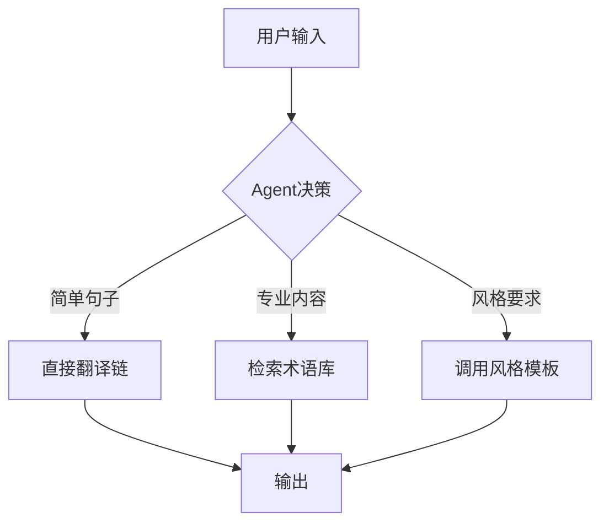

您的代码实现了一个基础的翻译功能，但仍有改进空间。以下是分步骤的优化方案，涵盖翻译质量提升、风格控制、知识库集成、模型调优和Agent化改造：

---

### 一、当前翻译功能评估
#### 优点：
1. 使用GPT-3.5作为翻译引擎，基础质量有保障
2. 支持异步处理（`ainvoke`）提高响应速度
3. 通过`frequency_penalty`/`presence_penalty`控制重复性

#### 不足：
1. 缺乏领域适应性（如学术/法律等专业术语处理）
2. 风格控制仅依赖提示词，不够系统化
3. 无术语一致性保障（长文档翻译时术语可能不一致）
4. 未利用翻译记忆库等专业工具

---

### 二、加强翻译功能的方案

#### 1. 实现多风格翻译（无需训练模型）
**方案：动态提示词引擎**
```python
# 在Prompts.py中定义风格模板
TRANSLATION_STYLES = {
    "academic": {
        "instruction": "作为学术翻译专家，请严格保持术语准确性...",
        "examples": [("原文1", "译文1"), ("原文2", "译文2")]
    },
    "casual": {
        "instruction": "作为本地化专家，请用口语化表达...",
        "examples": []
    }
}

# 修改gain_userinput函数
def gain_userinput(text, src_lang, tgt_lang, style):
    style_template = TRANSLATION_STYLES.get(style, {})
    return {
        "instruction": style_template.get("instruction", ""),
        "examples": style_template.get("examples", []),
        "text": text,
        "src_lang": src_lang,
        "tgt_lang": tgt_lang 
    }
```

#### 2. 挂接知识库
**方案：RAG（检索增强生成）**
```python
from langchain_community.vectorstores import FAISS
from langchain_openai import OpenAIEmbeddings

class TranslationWithKB:
    def __init__(self):
        self.embeddings = OpenAIEmbeddings()
        self.db = FAISS.load_local("term_kb", self.embeddings)
    
    def translate(self, text):
        # 检索相关术语
        docs = self.db.similarity_search(text, k=3)
        terms = "\n".join([d.page_content for d in docs])
        
        prompt = f"""已知术语库：
{terms}
        
请翻译以下内容，严格使用上述术语：
{text}"""
        return self.chain.run(prompt)
```

#### 3. 模型级优化
**方案：微调 vs 提示工程**
| 方法                | 实施步骤                                                                 | 适用场景                     |
|---------------------|--------------------------------------------------------------------------|----------------------------|
| **提示工程**         | 设计动态few-shot提示词，包含风格示例                                      | 快速适配新领域/风格          |
| **微调GPT-3.5**     | 收集500+平行语料，使用OpenAI Fine-tuning API训练                          | 专业领域(如医学/法律)        |
| **LoRA微调**        | 在本地用QLoRA技术微调开源模型(如Mixtral)                                  | 数据敏感/需要私有化部署      |

**微调示例代码**：
```python
from openai import OpenAI

client = OpenAI()
client.files.create(
  file=open("translation_data.jsonl", "rb"),
  purpose="fine-tune"
)

client.fine_tuning.jobs.create(
  training_file="file-abc123", 
  model="gpt-3.5-turbo",
  hyperparameters={
    "batch_size": 32,
    "learning_rate_multiplier": 0.2
  }
)
```

#### 4. 进阶功能实现
**术语一致性方案**：
```python
from collections import defaultdict

class TerminologyManager:
    def __init__(self):
        self.term_dict = defaultdict(dict)
    
    def add_term(self, src, tgt, domain):
        self.term_dict[domain][src] = tgt
    
    def preprocess(self, text, domain):
        for src, tgt in self.term_dict[domain].items():
            text = text.replace(src, f"[术语待译:{src}]")
        return text

# 使用方式
tm = TerminologyManager()
tm.add_term("transformer", "变压器", "electrical")
text = tm.preprocess("This transformer is...", "electrical")
```

---

### 三、改造为翻译Agent
**架构设计**：


**实现代码**：
```python
from langchain.agents import AgentExecutor, Tool, create_react_agent

class TranslationAgent:
    def __init__(self):
        self.tools = [
            Tool(
                name="DirectTranslate",
                func=self.chain.run,
                description="通用翻译"
            ),
            Tool(
                name="TerminologyLookup",
                func=self.term_db.search,
                description="术语查询"
            )
        ]
        
        self.agent = create_react_agent(
            llm=ChatOpenAI(temperature=0),
            tools=self.tools,
            prompt=self._get_agent_prompt()
        )
    
    def _get_agent_prompt(self):
        return """你是一个专业翻译官，请根据任务类型选择工具：
- 当包含专业术语时，先用TerminologyLookup查询
- 对诗歌等创意文本，添加style=poetic参数
- 普通文本直接用DirectTranslate

当前任务：{input}"""

    def run(self, text):
        return AgentExecutor(
            agent=self.agent, 
            tools=self.tools
        ).run(text)
```

---

### 四、完整优化路线图
1. **基础层**  
   - 实现动态风格提示词
   - 添加术语一致性检查
   - 集成基础检索功能

2. **进阶层**  
   - 构建领域知识库(法律/医学等)
   - 实现翻译记忆(TM)系统
   - 开发质量评估模块

3. **高级层**  
   - 微调领域专用模型
   - 实现多模态翻译(图文对照)
   - 部署为AutoGPT式自主Agent

---

### 五、关键注意事项
1. **成本控制**：
   - 对长文档采用"分块-翻译-重组"策略
   - 缓存频繁查询的术语结果

2. **质量保障**：
   - 实现BLEU/TER等自动评估
   - 人工反馈循环(HITL)

3. **合规性**：
   - 敏感数据本地化处理
   - 使用Azure OpenAI等合规API

通过上述方案，您可以将当前基础翻译器升级为具备领域适应能力、风格可控的专业级翻译系统。是否需要训练模型取决于具体场景数据量和质量要求，多数情况下提示工程+RAG即可满足需求。